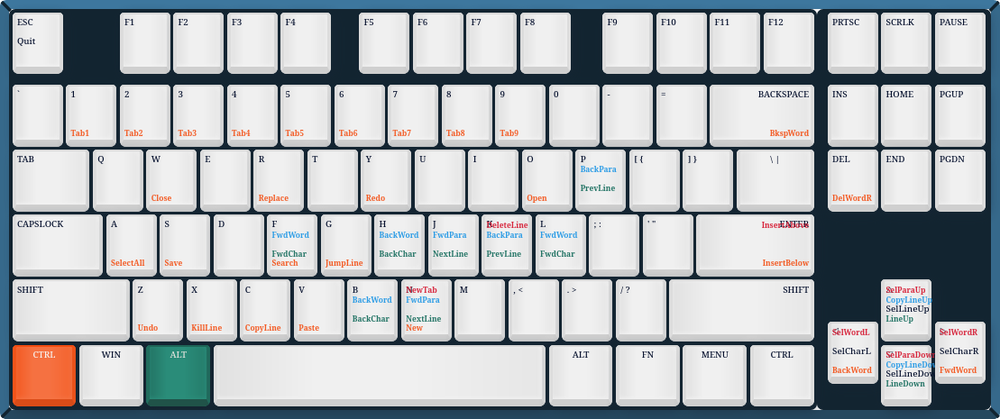

A basic Emacs configuration for users accustomed to modern editors like Kate, VS Code, Notepad++, Sublime Text, PyCharm, and many others. This config tries to make vanilla Emacs feel more like one of those editors. It gives you a nice starting point without fighting years of muscle memory.


Orange: CTRL
Green: ALT

# Try it out!
```
cd ~
rm -rf .emacs.d/
git clone https://github.com/BenediktChlopik/mortal-mode.git
mv mortal-mode .emacs.d/
```

This config was written bit by bit with the help of Claude and ChatGPT. If you want to add or change features without knowing Elisp, use those tools too! It's really fun.
